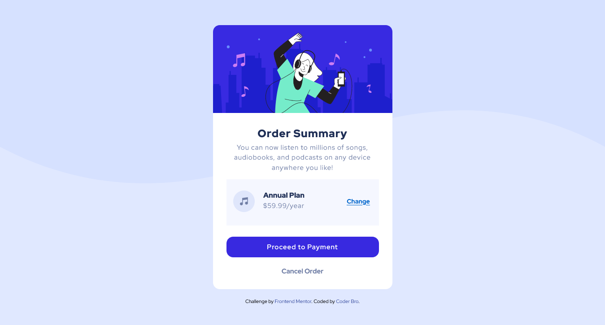

# Frontend Mentor - Order summary card solution

This is a solution to the [Order summary card challenge on Frontend Mentor](https://www.frontendmentor.io/challenges/order-summary-component-QlPmajDUj).
## Table of contents

- [Overview](#overview)
  - [Screenshot](#screenshot)
  - [Links](#links)
- [My process](#my-process)
  - [Built with](#HTML5-CSS3)
  - [What I learned](#what-i-learned)
  - [Continued development](#continued-development)
  - [Useful resources](#useful-resources)
- [Author](#CoderBro)
- [Acknowledgments](#acknowledgments)

### Screenshot

### Links

- Solution URL: [Add solution URL here](https://github.com/CoderrBro/Order-Summary)
- Live Site URL: [Add live site URL here](https://orderr-summaryy.netlify.app/)

### Built with

- Semantic HTML5 markup
- CSS custom properties
- Flexbox
- CSS Grid
- Mobile-first workflow

### What I learned

I didn't learn anything particularly new but I was incredibly happy to see how much I improved in the past days. This challenge would've been a struggle a while ago. After So Much practicing then now, I believe I'm finally comfortable with handling images, and make them responsive as well!

**Note: Delete this note and the content within this section and replace with your own learnings.**

### Continued development

I will Use this section to outline areas that you want to continue focusing on in future projects.

## Author
- Frontend Mentor - [@CoderBroo](https://www.frontendmentor.io/profile/CoderBroo)

